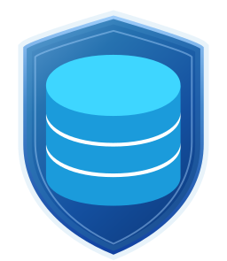
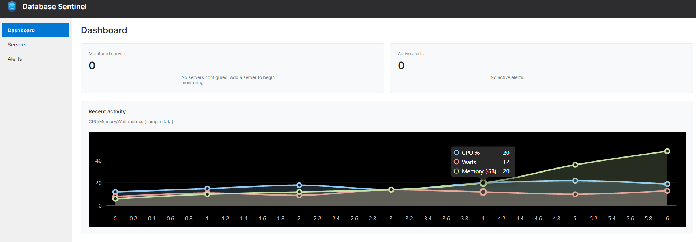

<div align="center">
  
</div>

# BlueFence Database Sentinel

A database monitoring application. Planned capabilities include real-time health and performance monitoring, alerting, dashboards, historical metrics and trending, and visibility into blocking, deadlocks, and query performance. This project is **work in progress**; features and architecture are being refined as we go.

### Tech stack

[](https://www.microsoft.com/sql-server)
[](https://www.postgresql.org/)
[](https://www.keycloak.org/)
[](https://dotnet.microsoft.com/)
[](https://avaloniaui.net/)

### Dashboard



## 🎯 Goals

- Monitor database servers (health, performance, availability).
- Store and query monitoring data for dashboards, alerts, and historical analysis.
- Provide a secure, multi-tenant–friendly experience with centralized identity.

## 🧩 Planned Stack & Integrations

- **Target databases**: [Microsoft SQL Server](https://www.microsoft.com/sql-server) first; support for additional database platforms may be added later.
- **Monitoring storage**: [PostgreSQL](https://www.postgresql.org/) for storing metrics, events, and related monitoring data.
- **Identity**: [Keycloak](https://www.keycloak.org/) as the identity provider (IDP) for authentication and single sign-on.

## 📁 Repository Structure

- `src/BlueFence.DatabaseSentinel.Api` – ASP.NET Core API (JWT auth, Swagger with OAuth2 + PKCE).
- `src/BlueFence.DatabaseSentinel` – Avalonia desktop UI (Auth Code + PKCE via MSAL; no login window shown until after sign-in).

## 🚀 Getting Started

### Keycloak, PostgreSQL and pgAdmin (Docker / Podman)

Developers run Keycloak with **HTTPS** in dev. One-time: generate a self-signed certificate (PowerShell as Administrator), then start the stack:

```powershell
.\docker\generate-certificate.ps1
```

```bash
docker compose up -d   # or: podman compose up -d
```

- **Keycloak**: https://localhost:8443 (admin / admin). Used for identity and API auth.
- **PostgreSQL**: localhost:5432. Hosts Keycloak’s DB and the **sentinel** DB used by the API for metrics.
- **pgAdmin**: http://localhost:5050 (admin@example.com / admin).

See [docker/README.md](docker/README.md) for connection strings, Podman troubleshooting, and **production deployment** (do not use the dev cert or this compose as-is in production).

After Keycloak is up, run the one-time setup script (see docker/README.md), then run the API and the Avalonia app from the `src` folder (e.g. open `BlueFence.slnx` in Visual Studio and run the desired project, or `dotnet run` from each project directory). The API serves Swagger at `/swagger` when running in Development; the desktop app signs in via the browser (MSAL) with no app window shown until authentication succeeds.

## 📄 License

MIT.
